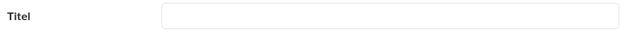
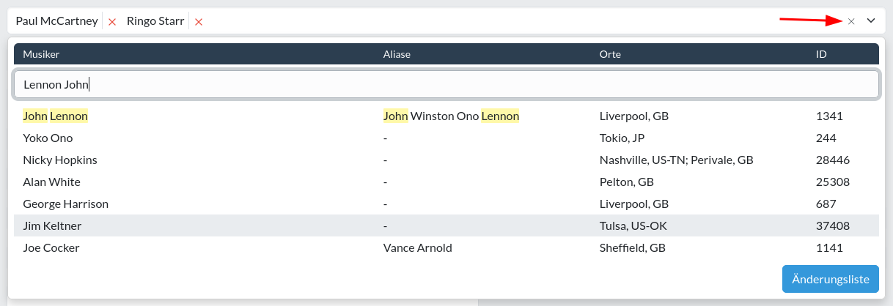

Bedienelement
=============

Die Seiten und Formulare der Datenbank verwenden
verschiedene [Steuer- oder Bedienelemente](https://de.wikipedia.org/wiki/Steuerelement), deren Funktionsweisen hier kurz
erklärt wird.

## Einfache Felder

### Textfeld

Ein Element, das jede Form von Text bis zu einer bestimmten Länge (meist 200 Zeichen) annimmt. Die Größe des Elements
und die erlaubte Länge des Textes stehen in keinem Zusammenhang.

### Textfeld mit variabler Grösse

Ein Textfeld, das praktisch unbegrenzt ist, was die Länge des Textes betrifft. Wenn man auf das Symbol in der unteren
rechten Ecke klickt und festhält, kann man die Grösse des Elementes frei verändern.

### Zahlenfeld

Ein Element das nur Zahlenwerte akzeptiert. Je nach Konfiguration lässt es manche Werte nicht zu (z.B. negative Zahlen
für Jahrgang). Mit den kleinen Knöpfchen an der rechten Seite des Elementes lässt sich durch den zulässigen Wertebereich
scrollen.

[comment]: <> (@formatter:off)  
!!! info "Hinweis: Vorsicht beim Scrollen"  
    Wenn der Fokus im Zahlenfeld liegt (also wenn der [Cursor](https://de.wikipedia.org/wiki/Cursor) im Element zu 
		sehen ist), kann Wert verändert werden, indem man das Scrollrad der Maus benutzt. 
  
[comment]: <> (@formatter:on)

## Auswahlfelder

### Einfaches Auswahlfeld/Dropdown

Beim Klicken auf dieses Feld klappt sich ein Menü auf ("dropdown"), aus dem man eine der Optionen wählen kann.

### Kombinationsfeld/Combobox

Kombination aus einem Textfeld und einem Auswahlfeld/Listenfeld, das mittels Texteingabe das Durchsuchen der
Listeneinträge möglich macht. Im oberen Bereich kann der Suchtext eingegeben werden, im unteren Bereich werden
Suchergebnisse angezeigt, von denen dann ein Eintrag per Mausklick ausgewählt werden kann. Per Mausrad lässt sich durch
die Ergebnisse scrollen.

Die Auswahl kann aufgehoben werden, indem du oben neben dem ausgewählten Eintrag auf das kleine rote "**x**" klickst.
Mit einem Klick auf den grünen Bleistift kannst du den ausgewählten Eintrag bearbeiten.

Der Knopf "Änderungsliste" schickt dich zu der [Änderungsliste](aenderungsliste.md) der zur Auswahl stehenden Einträge.
Mit dem "Hinzufügen" Knopf kannst du einen neuen Eintrag erstellen.
Ist kein Suchbegriff eingegeben, so öffnet der Knopf eine Seite mit einem leeren Formular, mit dem ein neuer Datensatz
erzeugt wird.
Ist ein Suchbegriff gegeben, so wird (je nach Tabelle) im Hintergrund ein neuer Datensatz mit dem Suchbegriff als Namen
erzeugt.

[comment]: <> (@formatter:off)  
!!! warning "Wichtig: Nach Erstellung weitere Informationen hinterlegen"  
    Wenn du einen Suchbegriff eingibst und dann mit dem "Hinzufügen" Knopf einen neuen Datensatz erstellst, beinhaltet 
    der neue Datensatz lediglich eine Angabe zum Namen. Erstellst du zum Beispiel auf diese Weise eine neue Band, dann 
    ist nur der Bandname gegeben - und das ist in denen meisten Fällen zu wenig Information. 
    Wenn zwei unterschiedliche Bands denselben Namen haben, dann könntest du sie nich voneinander unterscheiden.
    Aus diesem Grund solltest du bei neu erstellten Datensätzen weitere Angaben wie zum Beispiel Genres, Aliase oder 
    Links zu Wikipedia oder Discogs machen.   
    Dies gilt [grundsätzlich](grundsaetze.md#datensatze-mussen-aufschlussreich-sein) für alle Arten von Datensätzen. 
    Klicke auf den Bleistift neben dem erstellten Eintrag, um zu der Änderungsseite des erstellten Datensatzes zu gelangen.
    
[comment]: <> (@formatter:on)

[comment]: <> (@formatter:off)  
!!! info "Hinweis: Verknüpfungen"  
    Siehe auch: [Über Verknüpfungen](relationen.md)
  
[comment]: <> (@formatter:on)

### Combobox mit Mehrfachauswahl

Im Gegensatz zur normalen Combobox können hier mehrere Listeneinträge ausgewählt werden. Ausgewählte Einträge können
durch einen Klick auf das kleine rote "**x**" neben dem Eintrag wieder entfernt werden. Mit einem Klick auf das "**x**"
am rechten Ende der Combobox lässt sich die gesamte Auswahl aufheben.

## Spezialfelder

### Datumsfeld

Ein Feld für vollständige Datumsangaben.

Akzeptiert Angaben in der Form:

* `TT.MM.JJJJ` (Tag.Monat.Jahr)
* `JJJJ-MM-TT` (Jahr-Monat-Tag, [ISO 8601](https://de.wikipedia.org/wiki/ISO_8601))

Das Symbol am rechten Ende des Feldes öffnet einen Kalender zur Auswahl des Tages.

### Feld für partielles Datum

Ein Feld für Datumsangaben, die nicht unbedingt sein müssen: zum Beispiel Monat 8 und Jahr 1986 aber ohne Tag.

### Laufzeitfeld

Dieses Feld rechnet Angaben in ein zeitliches Format hh:mm:ss (Stunden:Minuten:Sekunden) um.

Angaben, die dem Format nicht vollständig entsprechen, werden akzeptiert und ggf. umgerechnet:

| Eingabetext | Entspricht |         |          |                                      | Ergebnis |
|-------------|------------|---------|----------|--------------------------------------|----------|
|             | Stunden    | Minuten | Sekunden | Anmerkung                            |          |
| 20          | 00         | 00      | 20       | 20 Sekunden                          | 00:00:20 |
| 120         | 00         | 02      | 00       | 120 Sekunden                         | 00:02:00 |
| 1:20        | 00         | 01      | 20       | 1 Minute und 20 Sekunden             | 00:01:20 |
| 1:80        | 00         | 02      | 20       | 1 Minute und 80 Sekunden             | 00:02:20 |
| 90:10       | 01         | 30      | 10       | 90 Minuten und 10 Sekunden           | 01:30:10 |
| 1:30:10     | 01         | 30      | 10       | 1 Stunde, 30 Minuten und 10 Sekunden | 01:30:10 |

### ISSN/ISBN/EAN

Ein Feld, welches Angaben für Standardnummern wie ISSN, ISBN oder EAN akzeptiert, validiert und in ein gut lesbares
Format umwandelt.
Aus einer ISBN ohne Formatierung:

... wird automatisch nach Speicherung eine ISBN mit Bindestrichen:

[comment]: <> (@formatter:off)  
!!! info "Info: Umwandlungen zwischen verschiedenen Formaten"  
    Umwandlungen von ISBN-10 zu ISBN-13 und von EAN zu ISSN werden automatisch vorgenommen.
  
[comment]: <> (@formatter:on)

## Inlines

Viele Formulare enthalten sogenannte Inlines. Inlines sind Formulare von verwandten Datensätzen, die in dem
Hauptformular eingebettet sind.
Wenn man beispielsweise einem Artikel einen Musiker hinzufügt, so tut man dies mithilfe vom Inline für die
Artikel-Musiker Beziehung.

Dabei werden einzelne Musiker zeilenweise angegeben; jede Zeile entspricht dabei einem kleinen Formular.
Im Falle des Musiker Inlines beinhaltet das Formular nur einziges [Auswahlfeld](#kombinationsfeldcombobox).
Neue Zeilen - und damit ein neues, leeres Formular - können mit dem "Musiker hinzufügen" Knopf am unteren Ende des
Inlines hinzugefügt werden.

Zeilen können mit dem Knopf mit dem roten "**x**" am rechten Ende einer Zeile zur Löschung markiert werden. Wird der
Datensatz gespeichert, werden die markierten Zeilen entfernt; die Beziehungen zwischen den Datensätzen werden dabei
gelöscht.

[comment]: <> (@formatter:off)  
!!! info "Hinweis: Verknüpfungen"  
    Siehe auch: [Über Verknüpfungen](relationen.md)
  
[comment]: <> (@formatter:on)
