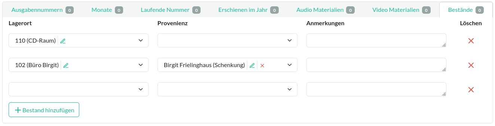

Bestand
=======

Ein Bestand beschreibt den Lagerort eines einzelnen Archivgut-Objekts.

Jeder Bestand besteht aus einem [Lagerort](lagerort.md "Lagerort") und optional aus einer
[Provenienz](provenienz.md "Provenienz").

Unter **Anmerkungen** können weitere Angaben eingefügt werden; so zum Beispiel Vermerke über den Zustand bzw. der
Beschaffenheit des Objektes. Jedem Bestand wird von der Datenbank eine einzigartige Signatur ([ID](id.md "ID"))
zugewiesen.

  
<figure markdown="span">  
  { width="800" .mb-1 }  
  <figcaption>Bestand Audio-Material</figcaption>  
</figure>

Siehe auch [Bedienelement#Inlines](bedienelement.md#inlines "Bedienelement").
