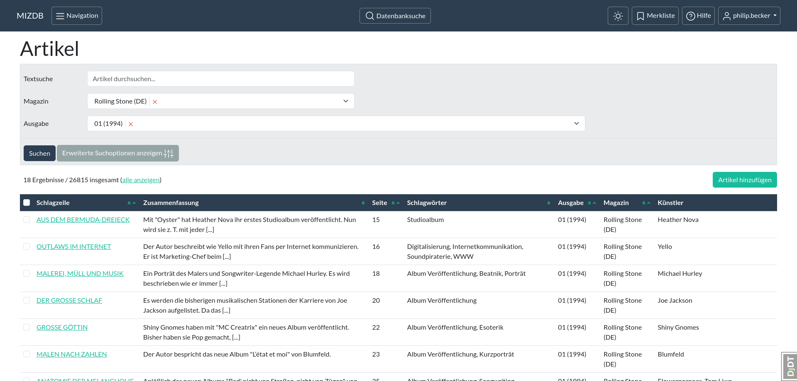
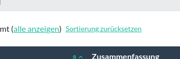

Änderungsliste
==============

Auf der Seite der Änderungsliste (auch "Übersichtsseite") kannst du [Datensätze](datensatz.md "Datensatz") einer
Kategorie durchsuchen und ändern. Der obere Teil der Seite dient der Eingabe von Suchparametern bzw. dem Setzen von
Filtern (siehe [Suchformular](suchformular.md "Suchformular")).

  
<figure markdown="span">  
  { width="300" .mb-1 }  
  <figcaption>Übersichtsseite der Artikel</figcaption>  
</figure>  
<figure markdown="span">  
  { width="300" .mb-1 }  
  <figcaption>Ein Suchformular</figcaption>  
</figure>  

Darauf folgt die Tabelle, die die Suchergebnisse darstellt. Die erste, unbeschriftete Spalte stellt
Auswahlkasten ([Checkboxes](https://de.wikipedia.org/wiki/Checkbox)) zur Verfügung, mit
welchen du Datensätze für Aktionen auswählen kannst, mehr dazu hier: [Aktionen](aktion.md "Aktion"). Danach kommen
beschriftete Spalten, in denen Daten der gefundenen Ergebnisse angezeigt werden, um einen Überblick über den Inhalt der
Datensätze zu ermöglichen.

### Sortierung

Mit den kleinen dreieckigen Symbolen (Chevrons) im Spaltenkopf einer Spalte kannst du die Sortierung der Ergebnisse
einstellen.

Mit einem Klick auf ein doppeltes Chevron in einer Spalte kannst du die Sortierung dieser Spalte einschalten oder
priorisieren.
Und mit einem Klick auf das einfache Chevron wechselst du die Art der Sortierung, also z.B. von aufsteigender Sortierung
dieser Spalte zu einer absteigender Sortierung.

Möchtest du die voreingestellte Sortierung wiederherstellen, dann klicke auf den Link mit der Beschriftung "Sortierung
zurücksetzen". Dieser erscheint über der Tabelle, sobald die Sortierung geändert wurde.

  
<figure markdown="span">  
  { width="300" .mb-1 }  
  <figcaption>Sortierung (Chevrons)</figcaption>  
</figure>  
<figure markdown="span">  
  { width="300" .mb-1 }  
  <figcaption>Sortierung zurücksetzen</figcaption>  
</figure>  

