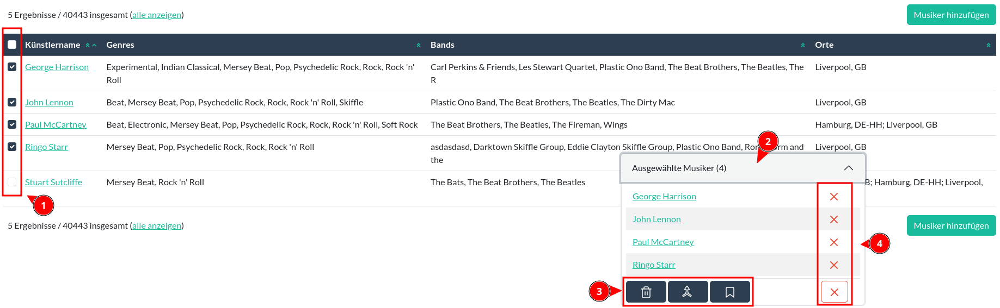

Aktionen
======

Mit Aktionen können mehrere Datensätze gleichzeitig bearbeitet werden.

Dazu musst du zunächst auf der [Übersichtsseite](aenderungsliste.md) Datensätze für die Aktion auswählen.
Setze dazu neben dem Datensatz, den du mit der Aktion bearbeiten möchtest, ein Häkchen (1). Mit der Checkbox im
Tabellenkopf fügst du alle momentan sichtbaren Datensätze zu deiner Auswahl hinzu.

  
<figure markdown="span">  
  { width="300" .mb-1 }  
  <figcaption>Auswahl von Musikern zur Aktion</figcaption>  
</figure>

Die aktuelle Auswahl findest du unten rechts im Fenster. 
Klicke auf den Knopf "**Ausgewählte ?**" (2), um die Auswahl anzuzeigen. 
Unten in der Auswahl befinden sich die Knöpfe, mit denen du eine Aktion für die ausgewählten Datensätze startest (3).

Um einen Datensatz von der Auswahl zu entfernen, klicke auf das rote **X** (4).
Die gesamte Auswahl kann aufgehoben werden, indem du auf das rote **X** am unteren Ende des Auswahlbereichs klickst.

## Verfügbare Aktionen

Es stehen folgende Aktionen zur Verfügung:

  
<figure markdown="span">  
  { width="300" .mb-1 }  
  <figcaption>(von links nach rechts) Löschen, Zusammenfügen, Merkliste</figcaption>  
</figure>

### Löschen

Hiermit wird die Löschung der ausgewählten Datensätze eingeleitet.

Siehe auch: [Löschen](loeschen.md "Löschen")

### Zusammenfügen

Mit dieser Aktionen können mehrere Datensätze zu einem einzigen Datensatz zusammengefügt werden. Aus den entsprechenden
Datensätzen wählst du den Datensatz aus, der am Ende des Prozesses übrig bleiben soll. Dieser "primäre Datensatz" wird
mit Daten der anderen Datensätze erweitert. Verweise (also z.B. auf Musiker oder Bands, siehe
[Bedienelement#Inlines](bedienelement.md#inlines "Bedienelement")) werden immer übernommen, sofern dem primären
Datensatz diese Verweise fehlen. Wird bei "Primären Datensatz erweitern" ein Häkchen gesetzt, werden auch Daten, die
keine Verweise darstellen und die dem primären Datensatz fehlen, dem primären Datensatzes hinzugefügt (wie zum Beispiel
Beschreibung oder Zusammenfassung).

[comment]: <> (@formatter:off)  
!!! caution "Achtung: die anderen Datensätze werden gelöscht!"  
    Nach dem Erweitern des primären Datensatzes werden die anderen Datensätze gelöscht. 
  
[comment]: <> (@formatter:on)

**Beispiel:**

Die folgenden drei Datensätze sollen zusammengefügt werden, da sie denselben Artikel beschreiben.

Klicke auf den Knopf für die "Zusammenfügen" Aktion im Auswahlbereich.
Danach musst du den primären Datensatz bestimmen.

  
<figure markdown="span">  
  { width="300" .mb-1 }  
  <figcaption>Primären Datensatz bestimmen</figcaption>  
</figure>

Dazu setzt du bei dem primären Datensatz in der Checkbox am linken Rand ein Häkchen (1).

Dem primären Datensatz fehlte eine Zusammenfassung und bei "Primären Datensatz erweitern" wurde ein Häkchen gesetzt (2):
Die fehlende Zusammenfassung soll also durch eine Zusammenfassung der anderen Datensätze ersetzt werden. Jedoch haben
die beiden anderen Datensätze unterschiedliche Zusammenfassungen - hier muss zunächst eine der beiden Zusammenfassungen
ausgewählt werden.

  
<figure markdown="span">  
  { width="300" .mb-1 }  
  <figcaption>Zusammenfassung festlegen</figcaption>  
</figure>

Das Resultat sieht nun so aus:

  
<figure markdown="span">  
  { width="300" .mb-1 }  
  <figcaption>Ergebnis Zusammenfügung</figcaption>  
</figure>

* nur der primäre Datensatz ist übrig geblieben - die anderen beiden wurden gelöscht
* eine Zusammenfassung wurde hinzugefügt, da sie vorher fehlte
* die Angabe zur Seite wurde **nicht** verändert, da sie vor dem Zusammenfügen bereits existierte
* die Schlagwörter des primären Datensatzes wurden um das Schlagwort ("sekundärer Datensatz") der anderen Datensätze
  erweitert
* die Künstler des primären Datensatzes wurden um die Künstler der anderen Datensätze erweitert

### Auf Merkliste setzen

Fügt die ausgewählten Datensätze zu deiner [Merkliste](merkliste.md) hinzu.
