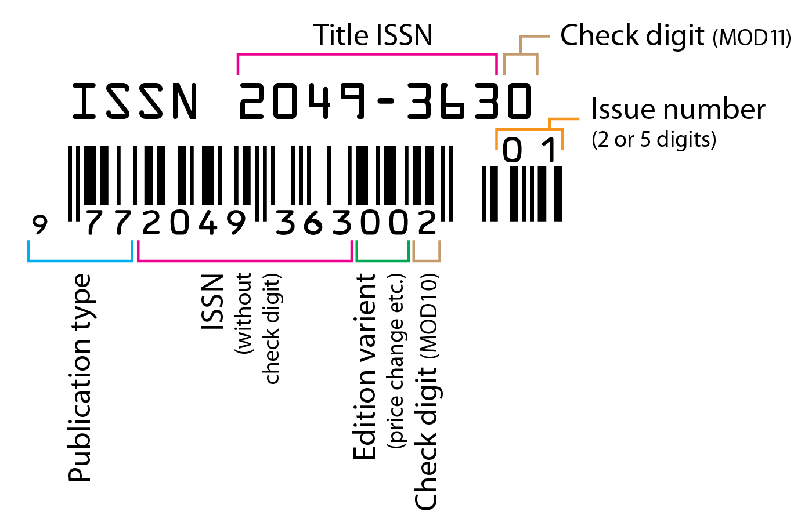

Ausgabe
=======

In dieser Kategorie werden Hefte von [Magazinen](magazin.md "Magazin") (Zeitschriften) gelistet.

## Erfassung

Eine Ausgabe kann durch verschiedene Angaben identifiziert werden, die u.a. auf der Titelseite, dem Rücken des Heftes
oder im Impressum gefunden werden können. Die meisten Angaben sollten selbsterklärend sein, aber es gibt einige
Feinheiten, auf die geachtet werden muss:

### Ausgabennummer und die laufende Nummer

Mit Ausgabennummer (auch oft auch einfach nur "Nummer") ist die Nummer gemeint, welche bei jedem Jahrgang erneut von
Eins gezählt wird. Im Vergleich dazu wird die laufende Nummer seit der ersten Ausgabe des Magazins durch jeden Jahrgang
hindurch weiter hoch gezählt. Die laufende Nummer ist häufig auf der Seite der Inhaltsangabe oder dem Impressum zu
finden.

Die Ausgabennummer kann auch im Strichcode enthalten sein:

  
<figure markdown="span">  
  { width="300" .mb-1 }  
  <figcaption>Strichcode mit Ausgabennummer ("Issue Number")</figcaption>  
</figure>  

### Ausgabennummer entspricht nicht unbedingt der Monatszahl

Es kommt häufig vor, dass die *angegebene* Ausgabennummer mit der Monatszahl übereinstimmt (Bsp.: Ausgabe mit Nummer 9
erschien im September).
Allerdings lässt sich von der Monatszahl alleine keine Ausgabennummer ableiten: Nur weil die Ausgabe im Mai erschien,
bedeutet es nicht, dass die Ausgabe die Nummer 5 hat. Umgekehrt gilt das natürlich genau so: Eine Ausgabe mit der Nummer
5 muss nicht im Mai erschienen sein.

[comment]: <> (@formatter:off)  
!!! info "Hinweis: nichts erfinden!"  
    Der [Grundsatz](grundsaetze.md "Grundsätze"), **nichts zu erfinden**, greift hier; wenn keine Ausgabennummer angegeben
		ist, dann sollte auch keine eingetragen werden.  
  
[comment]: <> (@formatter:on)

### Erscheinungsdatum

Das Erscheinungsdatum ist häufig im Impressum oder auf der Seite der Inhaltsangabe zu finden. Darüber hinaus geben viele
Zeitschriften das Erscheinungsdatum der *nächsten* Ausgabe an - diese Vorschau auf das nächste Heft ist meistens auf
den letzten Seiten der Ausgabe zu finden.

## Felder

### Magazin

Der Name des [Magazins](magazin.md "Magazin") der Ausgabe.

### Bearbeitungsstatus

Der Stand der Bearbeitung/Erfassung der [Artikel](artikel.md "Artikel") der Ausgabe.

### Sonderausgabe

Für Ausgaben, die außerhalb des üblichen [Turnus](https://de.wikipedia.org/wiki/Turnus) veröffentlicht wurden.

Wird diese Ausgabe als Sonderausgabe markiert, wird für die [textliche Repräsentation](#textliche-darstellung) des
Datensatzes (welche u.a. für die [Änderungsliste](aenderungsliste.md "Änderungsliste") benutzt wird) die
[Beschreibung](#beschreibung) benutzt anstatt der numerischen Angaben wie Ausgabennummer.

### Erscheinungsdatum

Das Datum, an dem die Ausgabe erschienen ist. Häufig wird am Ende des Heftes das Erscheinungsdatum der *nächsten*
Ausgabe bekannt gegeben.

Siehe auch [Bedienelement#Datumsfeld](bedienelement.md#datumsfeld "Datumsfeld").

### Jahrgang

Der Jahrgang der Ausgabe.

### Beschreibung

Ein Feld für weitere Angaben, welche in kein anderes der Felder passen.

[comment]: <> (@formatter:off)  
!!! tip "Sonderausgabe?"  
    In der Beschreibung kann der Titel einer Sonderausgabe angegeben werden. Wird diese Ausgabe als
    [Sonderausgabe](#sonderausgabe) markiert, so wird dieser Titel für die textliche Darstellung dieser Ausgabe benutzt.
  
[comment]: <> (@formatter:on)

### Bemerkungen

Notizen für Archiv-Mitarbeiter.

### Ausgabennummer

Die geläufigste numerische Angabe zur Kennzeichnung von Ausgaben.
Anders als die laufende Nummer beginnt die Ausgabennummer jeden Jahrgang erneut von vorne.
Häufig geben die letzten zwei Ziffern des
Strichcodes ([EAN-Code](https://de.wikipedia.org/wiki/European_Article_Number),
sowie [oben](#ausgabennummer-und-die-laufende-nummer)) der Zeitschrift die Ausgabennummer an.

Mehrere Nummern müssen einzeln eingetragen werden (siehe
[Bedienelement#Inlines](bedienelement.md#inlines "Bedienelement")).

### Monate

Die Monate, zu denen die Ausgabe erschienen ist.

Mehrere Monate müssen einzeln eingetragen werden (siehe
[Bedienelement#Inlines](bedienelement.md#inlines "Bedienelement")).

### laufende Nummer

Die Nummer, die seit der (aller-)ersten Ausgabe fortlaufend hochzählt.

Mehrere Nummern müssen einzeln eingetragen werden (siehe
[Bedienelement#Inlines](bedienelement.md#inlines "Bedienelement")).

### Jahr

Vierstellige Jahresangabe.

Mehrere Jahre müssen einzeln eingetragen werden (siehe
[Bedienelement#Inlines](bedienelement.md#inlines "Bedienelement")).

### Audio Materialien

Liegen der Ausgabe Audio Materialien (z.B. Compilations) bei, so können hier Verweise auf Datensätze dieser Materialien
hinterlegt werden.

### Video Materialien

Liegen der Ausgabe Video Materialien (z.B. DVDs) bei, so können hier Verweise auf Datensätze dieser Materialien
hinterlegt werden.

### Bestände

[Bestandsangaben](bestand.md "Bestand") zum Objekt. Für jeden einzelnen Gegenstand muss ein Bestand eingetragen werden.
Ist beispielsweise dasselbe Heft zweimal vorhanden, so müssen auch zwei Einträge unter Bestand stehen (siehe
[Bedienelement#Inlines](bedienelement.md#inlines "Bedienelement")). Unter '**Anmerkungen**' können weitere Angaben
eingefügt
werden; so zum Beispiel Vermerke über den Zustand bzw. der Beschaffenheit des Objektes.

## Textliche Darstellung

[Datensätze](datensatz.md "Datensatz") brauchen einen Titel; einen Text, der den Datensatz repräsentiert. Dieser Titel
wird zum Beispiel in der [Änderungsliste](aenderungsliste.md "Änderungsliste") und in der Suche mittels
[Kombinationsfeldern](bedienelement.md#kombinationsfeldcombobox "Bedienelement") verwendet.

Bei Büchern wäre dieser Text der Titel des Buches, bei Artikel ist es die Schlagzeile. Ausgaben besitzen jedoch meistens
keinen expliziten Titel. Stattdessen werden bei Ausgaben verschiedenen Angaben zum jeweiligen Datensatz
benutzt, um einen Titel zu konstruieren.

Grundsätzlich gilt:

* **Sonderausgabe**:  
  Ist die Ausgabe als **Sonderausgabe** markiert und ist eine Beschreibung vorhanden, so wird die Beschreibung als Titel
  verwendet. Andere Angaben fließen nicht in die Erzeugung des Titels ein.

* **Jahre vor Jahrgang**:  
  Jahresangaben werden bevorzugt. Besitzt die Ausgabe solche nicht, wird stattdessen der Jahrgang verwendet. Gibt es
  auch keinen Jahrgang, so wird der Platzhalter "k.A." verwendet.

* **Ausgabennummer vor laufende Nummer vor Datum vor Monat vor Beschreibung**:  
  Gibt es keine Angabe zur Ausgabennummer, so wird die laufende Nummer verwendet. Gibt es keine laufende Nummer, dann
  wird das Datum verwendet, und so weiter. Angaben in der Beschreibung sind dann die vorletzte Option.

* **keinerlei Angaben**:  
  Wenn es aufgrund fehlender Angaben nicht möglich ist, einen Titel zu abzuleiten, so wird als Titel "**Keine Angaben zu
  Ausgabe**" verwendet.

Nachfolgend einige Beispiele. Die Angaben, die letztendlich zum Titel beitragen, sind in fetter Schrift.

| Art                       | Angaben  |          |        |             |          |                | Ergebnis     |
|---------------------------|----------|----------|--------|-------------|----------|----------------|--------------|
|                           | Jahr     | Jahrgang | Nummer | lfd. Nummer | Monat    | Datum          | Titel        |
| Nummer als Ergebnis:      |          |          |        |             |          |                |              |
|                           | **2021** | 10       | **6**  | 121         | Juni     | 08.06.2021     | 2021-06      |
|                           |          | **10**   | **6**  | 121         | Juni     | 08.06.2021     | Jg. 10-06    |
|                           |          |          | **6**  | 121         | Juni     | 08.06.2021     | k.A.-06      |
| lfd. Nummer als Ergebnis: |          |          |        |             |          |                |              |
|                           | **2021** | 10       |        | **121**     | Juni     | 08.06.2021     | 121 (2021)   |
|                           |          | **10**   |        | **121**     | Juni     | 08.06.2021     | 121 (Jg. 10) |
|                           |          |          |        | **121**     | Juni     | 08.06.2021     | 121          |
| Datum als Ergebnis:       |          |          |        |             |          |                |              |
|                           | 2021     |          |        |             |          | **08.06.2021** | 2021-06-08   |
|                           | 2021     |          |        |             | Juni     | **08.06.2021** | 2021-06-08   |
| Monat als Ergebnis:       |          |          |        |             |          |                |              |
|                           | **2021** | 10       |        |             | **Juni** |                | 2021-Jun     |
|                           |          | **10**   |        |             | **Juni** |                | Jg. 10-Jun   |
|                           |          |          |        |             | **Juni** |                | k.A.-Jun     |

## Sortierung

Datensätze der Ausgaben sollten in einer chronologischen Ordnung gelistet werden; d.h. Ausgaben sollten in derselben
Reihenfolge, wie sie zeitlich erschienen sind, gelistet werden. Von der Datenbank wird nur dann eine chronologische
Ordnung versucht, wenn die Ausgaben-Datensätze, die gelistet werden sollen, von einem einzigen Magazin stammen.
Dabei richtet sich die Ordnung nach der Art von Angaben (Ausgabennummer, laufende Nummer, etc.), die unter den Ausgaben
am häufigsten auftreten.

Ist keine chronologische Ordnung möglich, werden die Datensätze zuerst nach Magazin, dann nach ihrem
[Titel](#textliche-darstellung) und schließlich nach [ID](id.md "ID") sortiert. Dabei werden die Titel
[lexikografisch](https://de.wikipedia.org/wiki/Lexikographische_Ordnung) sortiert, was zu einer Ordnung führen kann, die
augenscheinlich nicht chronologisch ist ("1970-Dez" kommt dabei dann vor "1970-Nov").

Siehe auch: [Änderungsliste#Sortierung](aenderungsliste.md#sortierung "Änderungsliste").

**Ausführliche Erklärung:**

Für eine chronologische Sortierung ist es nötig, dass die Datensätze chronologisch sinnvolle Angaben besitzen. Und da
Sortierung auf dem Vergleichen von Werten basiert ("Alice" kommt alphabetisch vor "Bob" weil "A" kleiner ist als "B"),
müssen diese verschiedenen Angaben der Ausgaben auch vergleichbar sein, damit am Ende eine sinnvolle Ordnung
herauskommt.

Bis auf wenige Ausnahmen besitzt fast jeder Ausgaben-Datensatz eine Jahresangabe, wodurch sich jeder Datensatz mit jedem
anderen beliebigen Datensatz bezüglich des Jahres vergleichen lässt: Datensätze "jahresmäßig" korrekt zu sortieren ist
also kein Problem.
Schwierig wird es erst, Datensätze innerhalb eines Jahres richtig zu sortieren, da hierfür die Angaben wie
Ausgabennummer oder Monate nötig sind - und hier liegt das Problem.

Während Monatsangaben sich sehr gut dazu eignen, eine Ausgabe zeitlich einzuschätzen, ist das mithilfe von
Ausgabennummern nur indirekt möglich. Nur weil die Nummer einer Ausgabe "5" ist, bedeutet das nicht unbedingt, dass sie
im Mai erschienen ist - und nur weil eine Ausgabe den Monat "April" hat, heißt es nicht, dass sie vor der Ausgabe mit
Nummer "5" erschienen ist. Die Angabe Ausgabennummer lässt sich mit der Angabe Monat nicht unmittelbar vergleichen und
eine zeitliche Einordnung ist mit ihr schwierig: Nummer "5" sagt zunächst nur aus, dass die Ausgabe zwischen Nummer "4"
und Nummer "6" erschienen ist, aber nicht wann genau in einem Jahr dies passiert ist (dafür müsste man u.a. wissen, wie
viele Hefte pro Jahr erscheinen).

Besonders deutlich wird diese "Unvergleichbarkeit" wenn man laufende Nummern bedenkt: erschien die Ausgabe mit laufender
Nummer "256" vor der Ausgabe "2021-Jun"? Diese Frage lässt sich nicht ohne weitere Informationen beantworten - und wenn
diese weiteren Informationen fehlen, ist eine rein chronologische Ordnung dieser zwei Ausgaben nicht möglich.

Am besten erstellt man also eine chronologische Ordnung, indem man Angaben derselben Art vergleicht. Zu diesem Zweck
ermittelt die Datenbank die Angaben, die am häufigsten in den darzustellenden Ausgaben auftauchen, und richtet die
Ordnung danach aus. Besitzen die meisten der Ausgaben eine Ausgabennummer, und nur einige wenige eine Monatsangabe, so
wird die Ordnung die Ausgabennummer priorisieren. Die Monatsangabe würde dann herangezogen, wenn Ausgaben dieselbe
Ausgabennummer hätten.

Unter den Magazinen herrscht bezüglich der Verwendung von Angaben keine Einheitlichkeit. Jedes Magazin macht ihr eigenes
Ding, bleibt aber größtenteils konsequent dabei: Magazin "Alice" versieht ihre Ausgaben nur mit Monatsangaben und
Magazin "Bob" benutzt ausschließlich laufende Nummern. Wie oben erklärt wurde, lassen sich diese beiden Arten von
Angaben nicht gut vergleichen. Für eine gemeinsame Auflistung der Ausgaben
*beider* Magazine ist eine chronologische Ordnung nicht möglich.
Aus diesem Grund wird die Datenbank grundsätzlich nur versuchen, eine chronologische Ordnung herzustellen, wenn die
darzustellenden Ausgaben von genau einem Magazin stammen.

## Admin Aktionen

### Jahrgang hinzufügen

Aktion zur Bearbeitung der Jahrgangsangaben der ausgewählten Ausgaben. Wähle zunächst eine Schlüssel-Ausgabe, die den
Beginn eines Jahrgangs darstellt, aus und gebe den Jahrgang dieser Schlüssel-Ausgabe an.
Die Jahrgangswerte der anderen Ausgaben werden danach in Abständen von einem Jahr (in Bezug zur Schlüssel-Ausgabe)
hochgezählt bzw. heruntergezählt. Wird als Jahrgang '0' eingegeben, werden die Angaben für Jahrgänge aller ausgewählten
Ausgaben gelöscht.
Alle bereits vorhandenen Angaben für Jahrgänge werden überschrieben.

### zu Broschüren bewegen

Ausgaben, die keine Artikel besitzen, können zu einer [Broschüre](broschuere.md "Broschüre"), zu einem
[Warenkatalog](warenkatalog.md "Warenkatalog") oder zu einem [Programmheft](programmheft.md "Programmheft") umgewandelt
und in die entsprechende Kategorie verschoben werden. Auf der Seite zur Bestätigung der Aktion können die Angaben zu den
Broschüren eingesehen und überarbeitet werden, bevor die Broschüren erstellt werden.

Möchtest du einige der ausgewählten Ausgaben doch nicht verschieben, so kannst du für die entsprechende Broschüre das
Häkchen aus "Änderungen bestätigen" entfernen. Die Art der Broschüre (also ob Broschüre, Warenkatalog oder Programmheft)
wählst du am unteren Ende der Bestätigungsseite aus.

[comment]: <> (@formatter:off)  
!!! danger "Achtung: die Ausgaben werden beim Verschieben gelöscht!" 
  
[comment]: <> (@formatter:on)

### Status ändern

Der [Bearbeitungsstatus](#bearbeitungsstatus) der ausgewählten Ausgaben kann hiermit leicht geändert werden.
 
