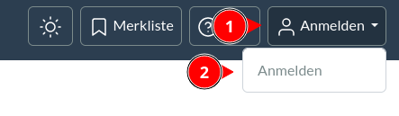
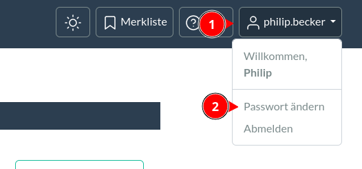
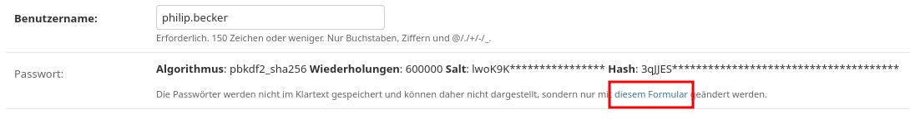
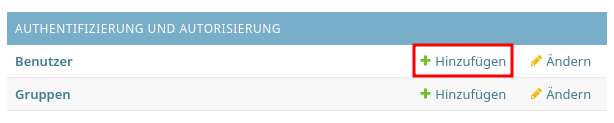
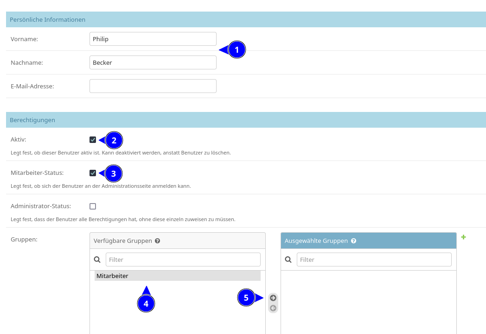

Benutzerverwaltung
========

## Anmelden und Abmelden

Zum Anmelden klicke in der Kopfzeile oben rechts auf **Anmelden** und wähle dann im Dropdown-Menü nochmal
**Anmelden** aus.

Zum Abmelden klicke wieder auf denselben Knopf und wähle **Abmelden** aus.

  
<figure markdown="span">  
  { width="300" .mb-1 }  
  <figcaption>Anmeldung</figcaption>  
</figure>

[comment]: <> (@formatter:off)  
!!! tip "Passwort vergessen?"  
    Wende dich an einem Admin. Dieser kann dein [Passwort zurücksetzen](#passwort-zurucksetzen).
  
[comment]: <> (@formatter:on)

## Passwort ändern

Um dein Passwort zu ändern, klicke auf den Button mit deinem Benutzernamen oben rechts und wähle dann
**Passwort ändern** aus.

  
<figure markdown="span">  
  { width="300" .mb-1 }  
  <figcaption>Passwort ändern</figcaption>  
</figure>

## Passwort zurücksetzen

Um ein Passwort zurückzusetzen, muss ein Admin ein neues Passwort vergeben.

1. Auf der Admin Seite auf **Benutzer** klicken
2. Den Benutzer aus der Liste auswählen
3. Unter **Passwort** auf den Link klicken
   
4. Neues Passwort vergeben

[comment]: <> (@formatter:off)  
!!! info "Passwörter"  
    Die Passwörter werden nicht in Klartext abgespeichert, deswegen können selbst Administratoren das Passwort eines
    Benutzers nicht einsehen.

[comment]: <> (@formatter:on)

## Benutzer erstellen

1. Auf der Admin Seite auf **Benutzer hinzufügen** klicken
   
2. Benutzername eingeben (empfohlenes Schema: `vorname.nachname` also z.B. "max.mustermann")
   
3. Vorläufiges Passwort vergeben (kann von dem Benutzer nachher frei geändert werden)
4. Auf **Sichern** klicken

In der Detailansicht des neuen Benutzers müssen noch weitere Angaben gemacht werden:

1. Den Namen des Benutzers eintragen
2. Das Häkchen bei **Aktiv** muss gesetzt sein
3. Falls der Benutzer Zugriff auf die Admin-Oberfläche haben soll, muss das Häkchen bei **Mitarbeiter** gesetzt werden
4. Unter **Gruppen** muss die Mitarbeiter Gruppe ausgewählt werden und
5. In die rechte Spalte verschoben werden (entweder mit dem Knopf oder mit Doppelklick auf "Mitarbeiter")
6. Unten auf **Sichern** klicken

  
<figure markdown="span">  
  { width="300" .mb-1 }  
  <figcaption>Benutzer Detailansicht</figcaption>  
</figure>

Der Benutzer ist nun eingerichtet. Der Benutzer kann sich jetzt einloggen und ein eigenes Passwort vergeben
(siehe [Passwort ändern](#passwort-andern)).
