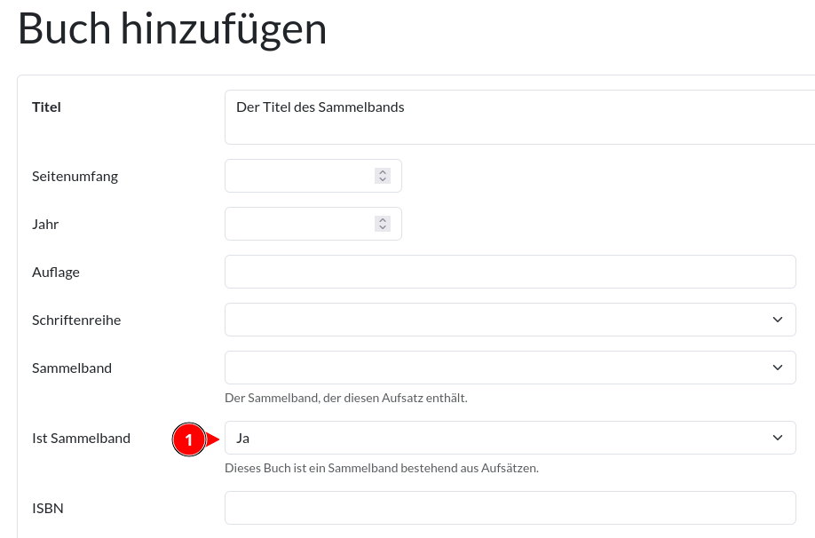
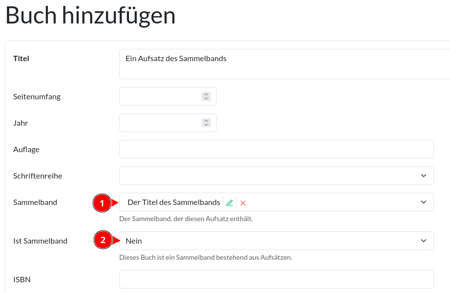

Buch
====

In dieser Kategorie befinden sich Bücher und
[Sammelbänder](https://de.wikipedia.org/wiki/Sammelband "wikipedia:de:Sammelband"). Mit Sammelband ist ein Buch
gemeint, welches mehrere Aufsätze bzw. Einzelschriften zusammenstellt.

### Sammelbänder

Bei einem Sammelband muss erst das Buch an sich eingetragen und als Sammelband markiert werden: dazu muss bei "**Ist
Sammelband**" "Ja" ausgewählt werden. Danach müssen die einzelnen Aufsätze ebenfalls als
Buch-[Datensatz](datensatz.md "Datensatz") erfasst werden, wobei unter **Sammelband** das anfangs erstellte Buch
ausgewählt werden muss.

Auf diese Weise besitzt jeder Sammelband Verweise auf dessen Aufsätze - und jeder Aufsatz-Datensatz ist als
Aufsatz eines Sammelbands erkenntlich.

  
<figure markdown="span">  
  { width="300" .mb-1 }  
  <figcaption>Sammelband erstellen</figcaption>  
</figure>  
<figure markdown="span">  
  { width="300" .mb-1 }  
  <figcaption>Aufsatz zu Sammelband hinzufügen</figcaption>  
</figure> 

## Felder

### Titel

Der Titel des Buches oder des Aufsatzes.

### Seitenumfang

Der Seitenumfang des Buches oder des Aufsatzes.

### Jahr

Erscheinungsjahr oder andere Jahresangaben zur zeitlichen Einordnung des Objektes.

### Auflage

Angabe zur
[Auflage des Buches](https://de.wikipedia.org/wiki/Auflage_(Publikation) "wikipedia:de:Auflage (Publikation)").

### Schriftenreihe

Gehört das Material zu einer Reihe von Büchern, sollte der Titel der Reihe hier angegeben werden.

### Sammelband

Entspricht der Datensatz einem Aufsatz eines Sammelbands, so muss der Sammelband hier ausgewählt werden.

### Ist Sammelband

Soll der Datensatz ein Sammelband beschreiben, so muss hier "Ja" ausgewählt werden. Nur Buch-Datensätze mit diesem
Häkchen tauchen in der Auswahlliste von [Sammelband](#sammelband) auf.

### ISBN

Die dreizehn-stellige internationale Standardbuchnummer
[ISBN](https://de.wikipedia.org/wiki/Internationale_Standardbuchnummer "ISBN"). ISBN-13 und EAN-13 sind identisch. 

Siehe auch [Bedienelement ISBN Feld](bedienelement.md#issnisbnean "Bedienelement").

### EAN

Die europäische Artikelnummer
[EAN](https://de.wikipedia.org/wiki/European_Article_Number "EAN"). ISBN-13 und EAN-13 sind identisch. 

Siehe auch [Bedienelement EAN Feld](bedienelement.md#issnisbnean "Bedienelement")

### Sprache

Angaben zur Sprache, in welcher das Buch verfasst wurde.

### Titel (Original)

Der Titel des Buches im nicht übersetzten Original.

### Jahr (Original)

Erscheinungsjahr des Originals.

### Beschreibung

Ein Feld für weitere Angaben, welche in kein anderes der Felder passen.

### Bemerkungen

Notizen für Archiv-Mitarbeiter.

### Autoren

Die Autorinnen und Autoren des Buches oder des Aufsatzes.

### Musiker

Bezieht sich das Objekt auf
[Musiker](musiker.md "Musiker"), so sollen diese hier angegeben. Bezieht sich das Objekt auf eine Band und wird diese
Band unter "Bands" angegeben, so müssen die Mitglieder der Band hier nicht zusätzlich noch einmal ausgewählt werden.

### Bands

Angaben zu [Bands](band.md "Band"), auf die sich das Objekt bezieht.

### Schlagwörter

[Schlagwörter](schlagwort.md "Schlagwort")/Deskriptoren/Tags zur Art (Interview, Porträt, usw.) und zum Themenbereich 
(z.B. '60er Jahre') des Objekts.

### Genres

Sind bezüglich des Objektes bestimmte
[Genres](genre.md "Genre") besonders relevant (z.B. bei einem Artikel über die Geschichte des Jazz), so sollen diese
hier angegeben werden. Genres von ausgewählten Musikern oder Bands müssen nicht nochmals gelistet werden.

### Orte

Auflistung der
[Orte](ort.md "Ort") (also: Städte, Länder), die für das Objekt relevant sind. Herkunftsorte der Musiker, Bands,
Autoren, usw. müssen hier nicht angegeben werden (sofern bereits beim Musiker usw. eingetragen). 

Siehe auch: [Erklärung Ort, Spielort und Veranstaltung](ort_spielort_veranstaltung.md "Ort, Spielort, Veranstaltung")

### Spielorte

Auflistung der
[Spielorte](spielort.md "Spielort") (also: Venues, Locations), auf die sich das Objekt bezieht. 

Siehe auch: [Erklärung Ort, Spielort und Veranstaltung](ort_spielort_veranstaltung.md "Ort, Spielort, Veranstaltung")

### Veranstaltungen

Hat das Objekt Bezug zu bestimmten
[Veranstaltungen](veranstaltung.md "Veranstaltung") (also: Konzerte, Festivals), so sollen diese hier angegeben werden.

Siehe auch: [Erklärung Ort, Spielort und Veranstaltung](ort_spielort_veranstaltung.md "Ort, Spielort, Veranstaltung")

### Personen

Angaben zu
[Personen](person.md "Person"), auf die sich das Objekt bezieht, die weder Autoren noch Musiker sind. Also z.B.
Produzenten. Die Personendaten der bereits gelisteten Autoren und Musiker müssen nicht nochmals gelistet werden.

### Herausgeber

Verweise auf relevante [Herausgeber](herausgeber.md "Herausgeber").

### Verlage

Verweise auf relevante [Verlage](verlag.md "Verlag").

### Bestände

[Bestandsangaben](bestand.md "Bestand") zum Objekt. Für jeden einzelnen Gegenstand muss ein Bestand eingetragen werden.
Ist beispielsweise dasselbe Buch zweimal vorhanden, so müssen auch zwei Einträge unter Bestand stehen (siehe
[Bedienelement#Inlines](bedienelement.md#inlines "Bedienelement")). Unter 'Anmerkungen' können weitere Angaben eingefügt
werden; so zum Beispiel Vermerke über den Zustand bzw. der Beschaffenheit des Objektes.

## Siehe auch

* [Wikipedia: Sammelband](https://de.wikipedia.org/wiki/Sammelband)
* [Wikipedia: Auflage (Publikation)](https://de.wikipedia.org/wiki/Auflage_(Publikation))
* [Wikipedia: Schriftenreihe](https://de.wikipedia.org/wiki/Schriftenreihe)
* [Wikipedia: Herausgeber](https://de.wikipedia.org/wiki/Herausgeber)
* [Wikipedia: Verlag](https://de.wikipedia.org/wiki/Verlag)
