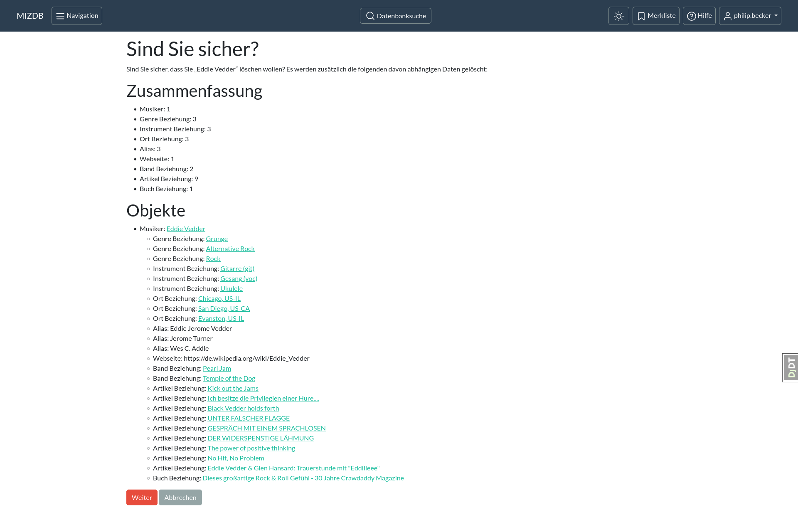
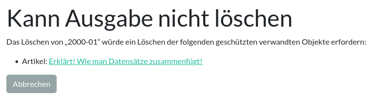

Löschen
=======

Beim Löschen wird der jeweilige [Datensatz](datensatz.md "Datensatz") aus der Datenbank entfernt.

[comment]: <> (@formatter:off)  
!!! danger "Achtung: Löschungen sind endgültig"  
    Wird ein Datensatz gelöscht, so geht dieser und alle Verknüpfungen, die der Datensatz mit anderen Datensätzen hatte,
    verloren!   
    Eine Wiederherstellung ist **nicht** möglich! 
  
[comment]: <> (@formatter:on)

Verweise von anderen Datensätzen auf diesen gelöschten Datensatz werden ebenfalls entfernt: löscht man ein Genre, so
wird auch bei jedem Musiker der Verweis auf jenes Genre gelöscht. Die Musiker Datensätze selber bleiben unverändert.

Alle von der Löschung betroffenen Objekte und Verweise (Beziehungen) werden in der Zusammenfassung auf der Seite, die
die Löschung einleitet, aufgelistet.

  
<figure markdown="span">  
  { width="300" .mb-1 }  
  <figcaption>Zusammenfassung</figcaption>  
</figure>

### Geschützte Objekte

Manche Datensätze können nur unter bestimmten Umständen gelöscht werden. Versucht man, einen Datensatz mit geschützten
Objekten zu löschen, so warnt die Datenbank:

  
<figure markdown="span">  
  { width="300" .mb-1 }  
  <figcaption>Löschung mit geschütztem Objekt</figcaption>  
</figure>

Um das zu erklären, hier ein Beispiel mit [Artikeln](artikel.md "Artikel") und [Ausgaben](ausgabe.md "Ausgabe"):

Ein Artikel erfordert immer eine Angabe zu der Ausgabe einer Zeitschrift, aus der der Artikel stammt. Dementsprechend
ist Ausgabe ein notwendig erforderliches Feld (das nicht leer bleiben darf) für jeden Datensatz eines Artikels.

Wird die Ausgabe eines Artikels gelöscht, würde auch der Verweis auf die Ausgabe aus dem Datensatz des Artikels
verschwinden; das Feld Ausgabe würde für den Artikel leer bleiben - dies ist aber nicht
erlaubt ([Referentielle Integrität](https://de.wikipedia.org/wiki/Referentielle_Integrit%C3%A4t)).

Die Datenbank würde dieses Beziehungsproblem dadurch lösen, dass sie
**den Artikel ebenfalls löscht**. In manchen Fällen ist dieses Verhalten durchaus erwünscht. Bei Ausgaben könnte dies
jedoch zur Löschung von vielen Artikeln auf einen Schlag führen.
Um eine Löschung mit drastischen Folgen vorzubeugen, ist die Löschung von manchen Arten von Datensätzen (Ausgaben,
Magazine) nur dann erlaubt, wenn es keine verwandten Datensätze gibt, die von dem zu löschenden Datensatz abhängig sind
und dementsprechend dann ebenfalls gelöscht werden würden.

Die Beziehung von Artikel zu Ausgabe gilt als geschützt: Eine Ausgabe *ohne* Artikel kann gelöscht werden. Eine
*mit* Artikeln jedoch *nicht*.
