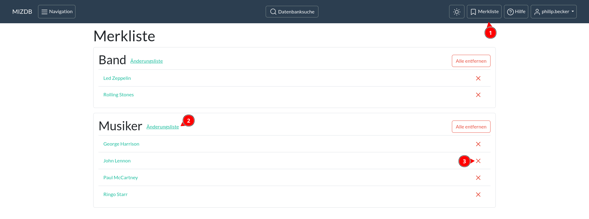
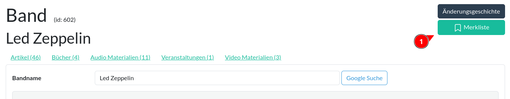

Merkliste
======

Mit der Merkliste kannst du deine eigene Liste von Datensätzen führen. Deine Liste erreichst du, indem du in der
Kopfzeile auf den Knopf mit der Aufschrift **Merkliste** klickst (1).

  
<figure markdown="span">  
  { width="300" .mb-1 }  
  <figcaption>Eine Merkliste</figcaption>  
</figure>

Mit dem Link "Änderungsliste" gelangst du zu der gefilterten Änderungsliste der Datensätze einer Kategorie. 
Einzelne Datensätze kannst du mit dem roten **X** von deiner Merkliste entfernen. Mit "Alle entfernen" werden alle
Datensätze einer Kategorie entfernt.

Datensätze kannst du entweder über eine Aktion der Änderungsliste hinzufügen 
(siehe: [Aktionen](aktion.md#auf-merkliste-setzen)) oder über einen Knopf in der Änderungsseite des Datensatzes
(siehe: [Änderungsseite](oberflaeche.md#anderungsseite)). Ist ein Datensatz bereits auf deiner Merkliste, wird der Knopf
in grüner Farber angezeigt.

  
<figure markdown="span">  
  { width="300" .mb-1 }  
  <figcaption>Merkliste Knopf auf der Änderungsseite</figcaption>  
</figure>

