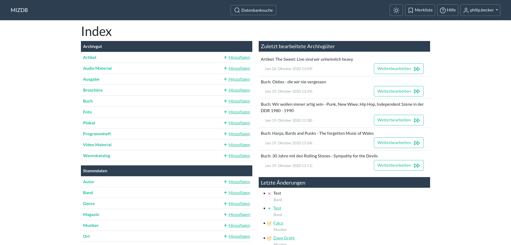
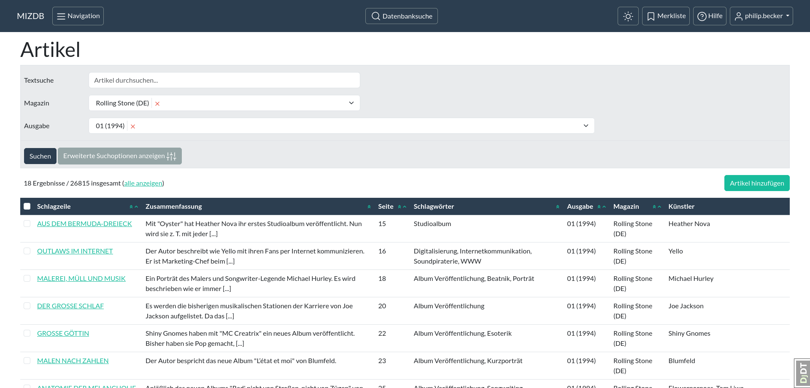
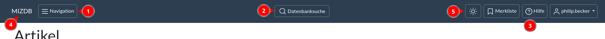
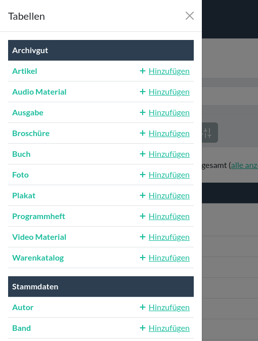
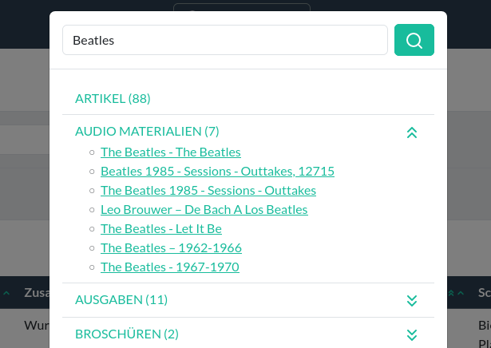
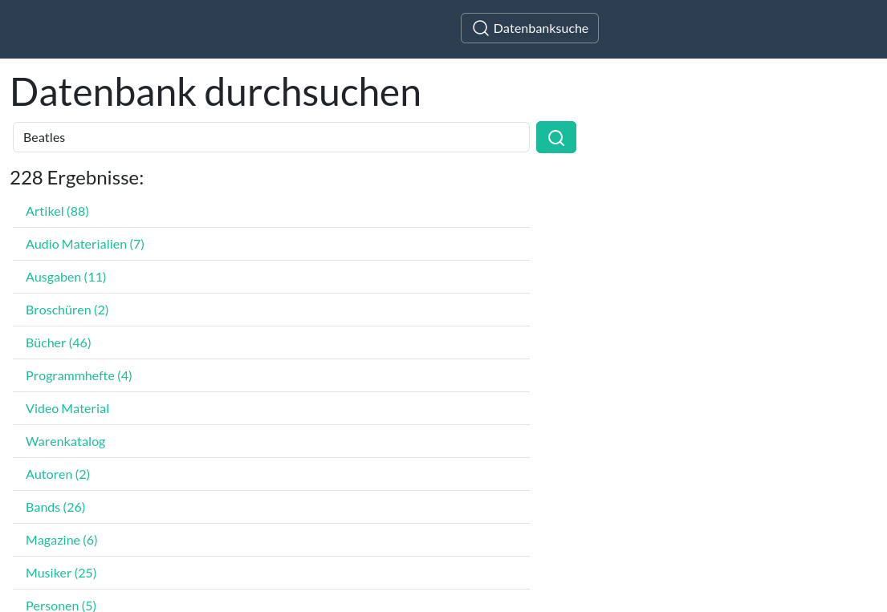
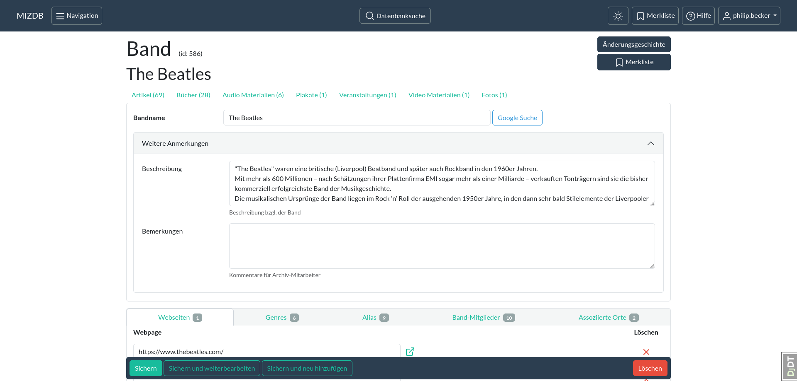

Oberfläche
==========

Hier werden einige Aspekte der Benutzeroberfläche erklärt.

### Index

Nach der Anmeldung an die Datenbank landest du im Hauptmenü, dem Index. Hier werden die verschiedenen Kategorien (also:
Artikel, Bücher, usw.) der Datenbank angezeigt. Unter "Archivgut" befinden sich die Kategorien, mit denen man
Archivmaterial erfasst. Darunter, unter "Stammdaten", sind die Kategorien, die bei der Erfassung am häufigst verwendet
werden.

Klickst du auf die Beschriftung einer Kategorie, gelangst du
zur [Übersichtsseite](aenderungsliste.md "Übersichtsseite") (auch "Änderungsliste") dieser Kategorie. Klickst du auf
den "Hinzufügen" Link neben der Kategorie, wirst du zu einem leeren Formular der Kategorie geführt, mit welchem du einen
neuen [Datensatz](datensatz.md "Datensatz") erstellen kannst.

Rechts auf der Indexseite findest du [Links](https://de.wikipedia.org/wiki/Hyperlink) zu der Änderungsseite der
Archivgüter (wie z.B. Artikel, Ausgaben oder Bücher), die von dir zuletzt bearbeitet wurden. Darunter befinden sich
Links zu Änderungsseiten von jeglichen Datensätzen, die von euch erstellt, bearbeitet oder gelöscht wurden.

  
<figure markdown="span">  
  { width="300" .mb-1 }  
  <figcaption>Der Index</figcaption>  
</figure>  
<figure markdown="span">  
  { width="300" .mb-1 }  
  <figcaption>Übersichtsseite der Artikel</figcaption>  
</figure>  

### Kopfzeile

In der Kopfzeile findest du die Navigation (1), die [Datenbanksuche](#datenbanksuche) (2) und Links zu der
[Merkliste](merkliste.md), der [Hilfe](index.md) und der [Benutzerverwaltung](benutzer.md) (3). Der MIZDB Schriftzug (4)
dient als Link zurück zum [Index](#index).

Neben der Merkliste findest du einen Knopf, mit dem du den Farbmodus (hell oder dunkel) wechseln kannst (5).

 
<figure markdown="span">  
  { width="300" .mb-1 }  
  <figcaption>Navigation</figcaption>  
</figure>  

### Datenbanksuche

Klickst du auf 'Datenbanksuche' öffnet sich ein kleines Suchformular. Dort gibst du einfach einen Suchbegriff ein und
die Datenbank wird sofort durchsucht.

Mit einem Klick auf den Suchbutton oder mit der Eingabetaste wirst du auf die Suchseite weitergeleitet.

  
<figure markdown="span">  
  { width="300" .mb-1 }  
  <figcaption>Datenbanksuche</figcaption>  
</figure>  
<figure markdown="span">  
  { width="300" .mb-1 }  
  <figcaption>Seite der Datenbanksuche</figcaption>  
</figure>  

### Änderungsseite

Auf der Änderungsseite kannst du neue Datensätze erstellen oder Änderungen an bereits existierenden Datensätzen
vornehmen. Dies wird mithilfe von [Webformularen](https://de.wikipedia.org/wiki/Webformular) bewerkstelligt.
Das Formular sammelt die Angaben, die du machst, und verschickt diese nach der Aufforderung zu Speicherung an den Server
der Datenbank, der diese Daten dann schließlich sichert.

Erklärungen zu den verschiedenen Bedienelementen, die bei der Dateneingabe verwendet werden, findest du auf der
entsprechenden Hilfe-Seite: [Bedienelement](bedienelement.md "Bedienelement").

  
<figure markdown="span">  
  { width="300" .mb-1 }  
  <figcaption>Änderungsseite der Beatles</figcaption>  
</figure>  

