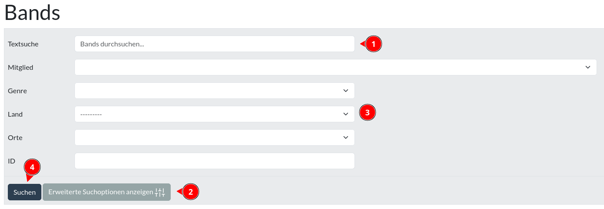
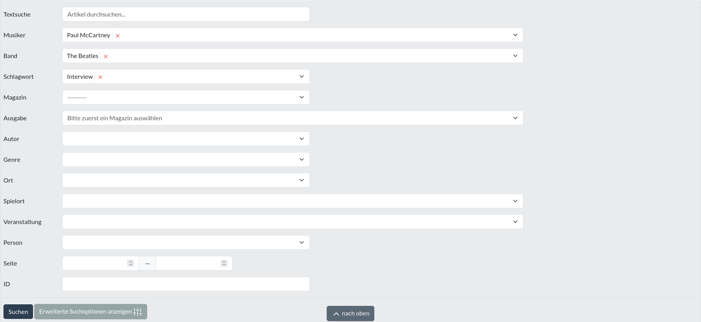
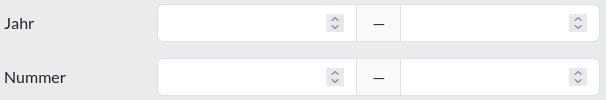
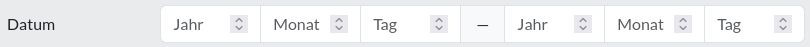
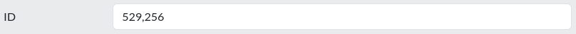

Suchformular
============

[Änderungslisten](aenderungsliste.md "Änderungsliste") bieten ein Formular an, mit welchem man genauere Parameter
(Filter) für eine Suchanfrage an die Datenbank einstellen kann.

Das Formular enthält ein Feld, mit dem du den Suchbegriff für eine [Volltextsuche](#textsuche) definieren kannst (1).
Darüber hinaus stellen manche Suchformulare noch mehr Felder (3) zur Verfügung, die mit einem Klick auf "Erweiterte
Suchoptionen anzeigen" (2) angezeigt (und auch wieder versteckt) werden können.

Um die Suche zu starten, klicke weiter unten auf den "Suche" Knopf (4).

  
<figure markdown="span">  
  { width="300" .mb-1 }  
  <figcaption>Band Suchformular</figcaption>  
</figure>  
<figure markdown="span">  
  { width="300" .mb-1 }  
  <figcaption>Artikel Suchformular</figcaption>  
</figure>

[comment]: <> (@formatter:off)  
!!! info "Hinweis: Suchparameter werden logisch mit UND verknüpft"  
    Das heisst, ein Datensatz muss alle Suchparameter erfüllen, damit er in der Ergebnisliste auftaucht.   
		Zum Beispiel: wählt man die Parameter Band "Rolling Stones" und Ort "Dortmund", so wird die Datenbank nach Datensätzen
		suchen, welche mit den "Rolling Stones" **und** dem Ort "Dortmund" verknüpft sind.
		Erfüllt ein Datensatz nur einen der Parameter (also: entweder "Rolling Stones" oder "Dortmund"), wird er nicht in der
		Ergebnisliste auftauchen.
  
[comment]: <> (@formatter:on)

### Textsuche

Bei der Textsuche werden Textfelder (wie z.B. Schlagzeile, Zusammenfassung oder Beschreibung) der Datensätze nach den
Suchbegriffen durchsucht.

Um auch Datensätze zu finden, die dem Suchbegriff nur ähnlich sind aber nicht exakt entsprechen, werden
die Texte der Datensätze und die Suchbegriffe zu ihrem [Wortstamm](https://de.wikipedia.org/wiki/Stemming) umgewandelt.
Die Suche wird dann auf Basis dieser Wortstämme ausgeführt.

So taucht zum Beispiel ein Datensatz mit dem Wort "Arzt" bei einer Suche nach "Die Ärzte" als Ergebnis auf, da "Arzt"
und "Ärzte" denselben Wortstamm haben.

## Felder

Neben den gewöhnlichen aus den Änderungsformularen bekannten [Bedienelementen](bedienelement.md "Bedienelement") tauchen
in Suchformularen auch noch Felder mit Besonderheiten auf.

### von - bis Felder

Hiermit kann ein Zahlenbereich von einschließlich X bis einschließlich Y (also: "größer gleich X und kleiner gleich Y")
angegeben werden. 
Wird nur in dem ersten Feld ein Wert eingetragen, so wird stattdessen nach genau diesem Wert gesucht (also: "gleich X").

### partielles Datum

Ähnlich wie das "von bis Feld", nur mit teilweisen Datumsangaben.

### ID

Ermöglicht es, Datensätze mittels ihrer [ID](id.md "ID")-Nummer zu finden. Mehrere Nummern mit Kommas trennen.

