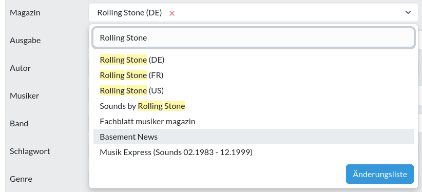
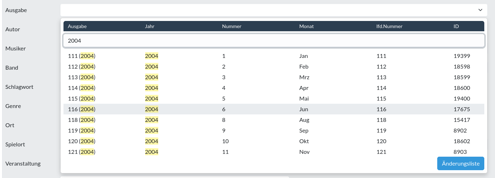
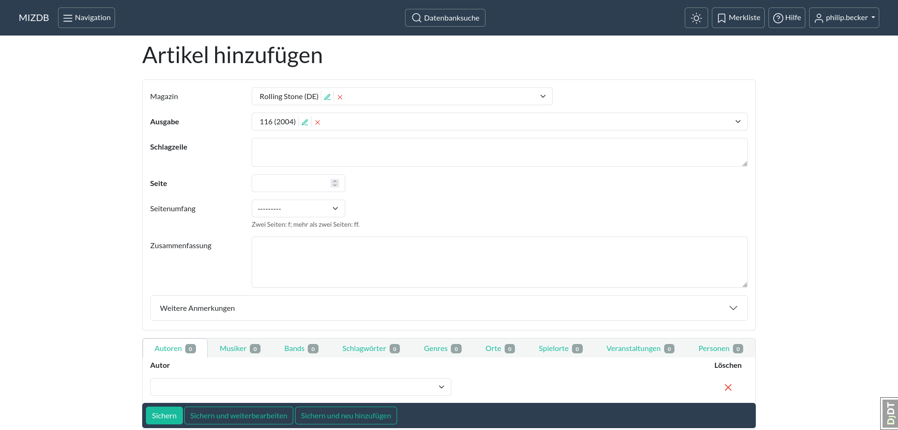
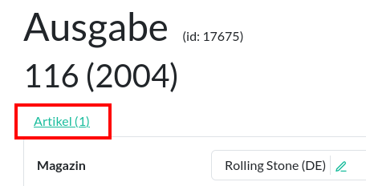
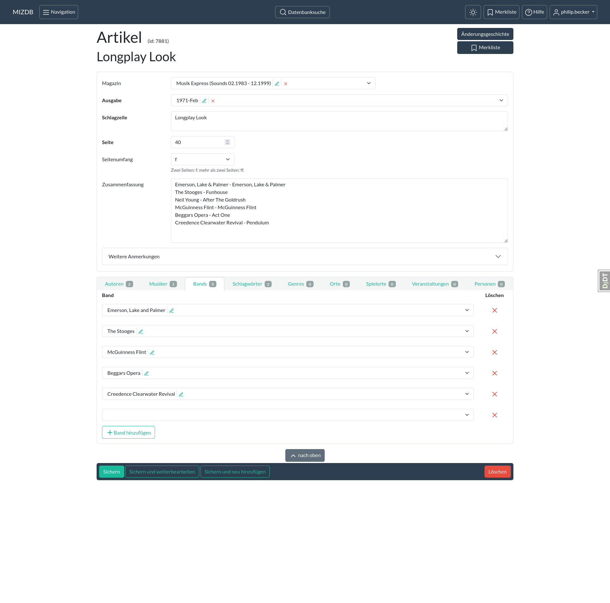

Erfassung von Artikeln
=======

Bei der Erfassung ist es deine Aufgabe, die wichtigsten Informationen, die in einem Artikel enthalten sind, in die
Datenbank einzufügen, sodass der Artikel bei einer Suche wiedergefunden werden kann; behandelt der Artikel ein
bestimmtes Thema, so muss der Artikel als Ergebnis bei einer Datenbank-Recherche zu diesem Thema auftauchen. Anhand der
Daten, die du zu dem Artikel in die Datenbank eingetragen hast, kann der Recherchierende entscheiden, ob der Artikel 
für sie/ihn interessant sein könnte.

Die Erfassung der Zeitungsartikel ist recht unkompliziert und ist damit gut für Anfänger als Einleitung in die Arbeit
mit der Datenbank geeignet.

## Erklärung an einem Beispiel

Für ein Beispiel nehmen wir mal an, dass du einen Artikel aus einem Heft des "Rolling Stone" Magazins erfassen willst.
Um mit der Erfassung zu beginnen, solltest du zuerst die Datenbank nach vorhandenen Artikeln dieses Heftes durchsuchen.

### Vorhandene Artikel suchen

Bevor du einen neuen Artikel hinzufügst, solltest du erst schauen, ob dieser schon in der Datenbank existiert.
Ist der Artikel bereits erfasst, solltest du ihn nicht noch einmal eintragen.

So suchst du nach den Artikeln eines Heftes:

1. im [Index/Hauptmenü](oberflaeche.md#index "Oberfläche") auf "**Artikel**" klicken
2. im [Suchformular](suchformular.md "Suchformular") auf "**Erweiterte Suchoptionen anzeigen**" klicken
3. im Suchformular das Feld "**[Magazin](magazin.md "Magazin")**" anklicken, den Namen des Magazins eintippen und dann
   das entsprechende Magazin aus der Liste auswählen
4. danach im Feld "**[Ausgabe](ausgabe.md)**" das Jahr der Ausgabe eingeben und die entsprechende Ausgabe auswählen
5. auf "**Suchen**" klicken

Daraufhin werden dir die Artikel des Heftes angezeigt, die bereits in der Datenbank eingetragen wurden.

<figure markdown="span">
  { width="300" .mb-1 }
  <figcaption>Artikel Suchformular</figcaption>
</figure>
<figure markdown="span">
  { width="300" .mb-1 }
  <figcaption>Magazin auswählen</figcaption>
</figure>
<figure markdown="span">
  { width="300" .mb-1 }
  <figcaption>Ausgabe auswählen</figcaption>
</figure>

[comment]: <> (@formatter:off)  
!!! info "Hinweis: Dropdown-Feld"  
    Mehr Informationen zur Verwendung eines Dropdown-Feldes findest du hier:
    [Bedienelement#Kombinationsfeld](bedienelement.md#kombinationsfeldcombobox).
  
[comment]: <> (@formatter:on)

[comment]: <> (@formatter:off)
!!! tip "Tipp: Die Suche spart dir Arbeit"
    Durch die Suche werden die Angaben zu **Magazin** und **Ausgabe** im Suchformular an die Formulare für neue Artikel
    weitergereicht und dort in die entsprechenden Felder automatisch eingefügt. Dadurch ersparst du dir etwas Arbeit.

[comment]: <> (@formatter:on)

### Neuen Artikel erstellen

Nun suchst du dir aus der Zeitschrift den Artikel heraus, **der noch nicht in die Datenbank eingetragen wurde** und den
du erfassen willst (siehe auch: [Welche Artikel müssen erfasst werden](#welche-artikel-mussen-erfasst-werden)).
Um mit der Erfassung zu beginnen, klicke auf der Übersichtsseite der Artikel auf den Knopf "Artikel hinzufügen".
Es wird ein leeres Formular angezeigt, in das du die Daten des Artikels eintragen kannst.

  
<figure markdown="span">  
  { width="300" .mb-1 }  
  <figcaption>Artikel hinzufügen</figcaption>  
</figure>
<figure markdown="span">  
  { width="300" .mb-1 }  
  <figcaption>Artikel Formular</figcaption>  
</figure>

Zunächst solltest du die Grunddaten des Artikels eintragen, damit man anhand der Daten im
Artikel-[Datensatz](datensatz.md "Datensatz") zu dem "echten" Artikel in der physischen Zeitschrift gelangen kann. Dazu
gibst du das **Magazin**, die **Ausgabe** (diese sollten bereits eingetragen sein, sofern du
die [Suche](#vorhandene-artikel-suchen) gemacht hast) und die **Schlagzeile** ein.

Je nach Artikel ist es manchmal nicht ganz klar, was die Schlagzeile eines Artikels ist. Lasse dich davon nicht
entmutigen; die Schlagzeile dient schlicht als Erkennungsmerkmal und ist inhaltlich nicht so sehr wichtig.
Trage also das ein, was du als Schlagzeile erachtest. Oder schaue im Inhaltsverzeichnis der Ausgabe nach, was dort als
Titel angegeben ist.

Anschließend musst du die **Seite**, an der der Artikel beginnt, und den **Seitenumfang** eintragen. Ist der Artikel nur
eine Seite lang, musst du bei **Seitenumfang** nichts angeben. Für Artikel, die zwei Seiten umfassen, trägst du hier "f"
ein, ansonsten "ff".

Hast du diese Angaben gemacht, solltest du erst einmal zwischenspeichern, indem du unten auf den Knopf mit der
Aufschrift "Sichern und weiterbearbeiten" klickst.

  
<figure markdown="span">  
  { width="300" .mb-1 }  
  <figcaption>Speicher Knöpfe</figcaption>  
</figure>

Da der Datensatz der Ausgabe den [Lagerort](lagerort.md "Lagerort") des Heftes angibt, hat man nun alle Angaben zur
Hand, die man braucht, um den Artikel im "echten" Heft wiederzufinden.

[comment]: <> (@formatter:off)
!!! caution "Achtung: Abspeichern ist notwendig!"
    Änderungen werden nur übernommen, wenn du auf einen der "[Sichern](sichern.md "Sichern")" Knöpfe klickst.
    Verlässt du das Formular (z.B. indem du das Fenster schließt oder zu einer anderen Seite navigierst), ohne es zu
    sichern, geht deine Arbeit verloren!
    Es sollte eine Warnung auftauchen, wenn du versuchst, ein Formular mit ungespeicherten Änderungen zu verlassen.

[comment]: <> (@formatter:on)

### Artikel Inhalt aufnehmen

Bisher hast du nur Angaben zu dem Heft, der Schlagzeile und der Seitenzahl gemacht. Das ist aber noch nicht
aussagekräftig genug, denn über den Inhalt des Artikels hast du noch keine Angaben gemacht.
Also ist es jetzt an der Zeit, dass du dir den Artikel einmal durchliest. Anschließend solltest du eine
Zusammenfassung des Artikels in das entsprechende Feld des Formulars eintragen.

Anhand der Zusammenfassung werden Recherchierende feststellen können, ob der Artikel für sie interessant ist oder nicht.
Dementsprechend solltest du dir hier Mühe geben, die relevanten Teile eines Artikels anzugeben. Dabei ist es wichtiger,
dass alle wichtigen, interessanten Informationen enthalten sind, als dass du einen schönen Text schreibst. Wenn es dir
leichter fällt, kannst du anstelle von Fließtext auch Stichpunkte benutzen. Die Hauptsache ist, dass die Informationen
in die Datenbank übertragen werden. Die Zusammenfassung wird in die [Volltextsuche](suchformular.md#textsuche)
miteinbezogen; d.h. ein Artikel kann anhand der Angaben in der Zusammenfassung wiedergefunden werden.

[comment]: <> (@formatter:off)  
!!! info "Hinweis: Nur Relevantes eintragen"
    Machst du keine Angaben, kann der Artikel auch nie gefunden werden. Machst du hingegen viele ungenaue oder 
    überflüssige Angaben, so kann der Artikel unerwünscht als Ergebnis auftauchen. Trage also nur das ein, was für den
    Artikel relevant ist, oder was für das Thema des Artikels von Bedeutung ist.   
    **Beispiel**: Wird in einem Artikel eine Band nur beiläufig erwähnt, so solltest du diese Band nicht mit in die
    Zusammenfassung aufnehmen oder eine [Verknüpfung](#verknupfungen-hinzufugen) für diese Band hinzufügen.

[comment]: <> (@formatter:on)

[comment]: <> (@formatter:off)  
!!! tip "Tipp: Textfeld zu klein?"  
    Manche Textfelder, wie z.B. "Zusammenfassung", kannst du vergrößern oder verkleinern, in dem du im Textfeld unten 
    rechts auf das kleine Symbol klickst, die Maustaste gedrückt hältst und dann die Maus rauf- oder runterbewegst.  
    Siehe: [Bedienelement#Textfeld](bedienelement.md#textfeld-mit-variabler-grosse).

[comment]: <> (@formatter:on)

### Verknüpfungen hinzufügen

Neben der Volltextsuche lassen sich Artikel auch über Verknüpfungen (oder Beziehungen) mit anderen Datensätzen, wie zum
Beispiel mit Bands oder Musikern, finden. Eine solche Verknüpfung hast du bereits gesehen: die Ausgabe. Ein Artikel ist
immer mit einer Ausgabe, dem Heft, verknüpft. Wenn du neben der Ausgabe auf den kleinen grünen Bleistift klickst,
gelangst du auf die Änderungsseite der Ausgabe. Und andersherum gelangst du von der Änderungsseite der Ausgabe zu einer
Auflistung aller Artikeln dieser Ausgabe, indem du unter dem Namen der Ausgabe auf den Link mit der Beschriftung
"Artikel" klickst.

  
<figure markdown="span">  
  { width="300" .mb-1 }  
  <figcaption>Ausgabe ändern Knopf</figcaption>  
</figure>
<figure markdown="span">  
  { width="300" .mb-1 }  
  <figcaption>Artikel einer Ausgabe</figcaption>  
</figure>

[comment]: <> (@formatter:off)  
!!! warning "Wichtig: Verknüpfungen verstehen"  
    Es ist wichtig, dass du verstehst, wie die Verknüpfungen oder Beziehungen funktionieren und welchen Einfluss 
    Änderungen an Beziehungen auf die Daten in der Datenbank haben können!    
    Mehr dazu gibt es hier: [Verknüpfungen](relationen.md).
  
[comment]: <> (@formatter:on)

Weitere Verknüpfungen kannst du unten im Formular hinzufügen. Um beispielsweise eine Verknüpfung zwischen dem
Artikel und der Band "The Rolling Stones" herzustellen, klicke unten auf den Reiter mit der Aufschrift "Band" (1).
Klicke dann in ein leeres Dropdown-Feld (2) und gebe im Dropdown-Menü den Namen der Band ein (3). Aus der Ergebnisliste
wählst du dann die entsprechende Band mit einem Klick aus (4).
Mit dem Knopf "Änderungsliste" (5) rufst du die Ergebnisse in der Bands-Übersichtsseite auf - hier kannst du die
Ergebnisse genauer anschauen.
Findest du keine passende Band, kannst du mit dem Knopf "Hinzufügen" (6) eine neue Band erstellen.

  
<figure markdown="span">  
  { width="300" .mb-1 }  
  <figcaption>Verknüpfung mit einer Band hinzufügen</figcaption>  
</figure>

Um eine weitere Verknüpfung hinzuzufügen, klicke auf den Knopf "Band hinzufügen". Daraufhin erscheint ein weiteres
Dropdown-Element in einer neuen Zeile.
Um eine Verknüpfung zu entfernen, klicke auf das rote "X" in der entsprechenden Zeile. Die Zeile wird daraufhin zur
Löschung markiert. Wenn du den Artikel abspeicherst, wird die *Verknüpfung* gelöscht. Der Datensatz, der mit dem Artikel
verknüpft war (also hier die Band "Rolling Stones"), wird dabei *nicht* gelöscht - nur die Verknüpfung zwischen dem
Artikel und der Band wird gelöscht.

<figure markdown="span">  
  { width="300" .mb-1 }  
  <figcaption>Hinzufügen & Löschen</figcaption>  
</figure>

[comment]: <> (@formatter:off)  
!!! info "Hinweis: Inlines"  
    Der oben beschriebene Bereich, mit dem du Verknüpfungen hinzufügen kannst, ist hier näher beschrieben:
    [Bedienelement#Inlines](bedienelement.md#inlines).
  
[comment]: <> (@formatter:on)

### Bearbeitung abschließen

Wenn du mit der Erfassung dieses Artikels fertig bist und direkt den nächsten erfassen willst, klicke
auf "[Sichern](sichern.md "Sichern") und neu hinzufügen". Der Artikel wird abgespeichert, es wird ein neues, leeres
Formular angezeigt und das Magazin und die Ausgabe werden eingefügt (sofern du, wie vorgeschlagen,
die [Suche](#vorhandene-artikel-suchen) mit der Übersichtsseite gemacht hast).

Drückst du auf "Sichern und weiterbearbeiten" wird der Artikel abgespeichert und das Formular für den Artikel neu
geladen.
Mit dem "Sichern" Knopfs gelangst du, nachdem der Artikel gespeichert wurde, zurück zu der Übersichtsliste der Artikel.

  
<figure markdown="span">  
  { width="300" .mb-1 }  
  <figcaption>Speicher Knöpfe</figcaption>  
</figure>

[comment]: <> (@formatter:off)  
!!! tip "Tipp: Welchen Knopf soll ich benutzen?"  
    Der "**Sichern und neu hinzufügen**" Knopf bietet sich an, wenn du mit der Erfassung eines Objekts fertig geworden bist
    und direkt mit der Erfassung des nächsten Objekts anfangen möchtest.  
    Wenn du dabei bist, von der Übersichtsseite aus einige Datensätze zu ändern, dann benutze den "**Sichern**" Knopf, um
    sofort wieder zu der Übersichtsseite zurückzukehren.  
    "**Sichern und weiterbearbeiten**" kannst du während der Erfassung immer wieder mal benutzen, um deine Arbeit 
    abzuspeichern.   
    Siehe auch: [Sichern](sichern.md).
  
[comment]: <> (@formatter:on)

## Welche Artikel müssen erfasst werden?

Prinzipiell kann jeder Text einer Ausgabe erfasst und eingetragen werden. Jedoch haben manche Abschnitte wenig
Informationsgehalt: News mit einem Umfang von 20 Wörtern haben meist nicht viel Aussagekraft. Aus Zeitgründen ist die
Richtlinie daher, dass nur echte Artikel erfasst werden *müssen* und andere Texte eher nicht erfasst werden *sollten.*
Ein "echter Artikel" wäre z.B. etwas, das im Inhaltsverzeichnis erwähnt wird, eine Autorenangabe hat oder etwas, das
über einen gewissen Umfang verfügt. "Andere Texte" wären dann News oder Rezensionen von Veröffentlichungen (also z.B.
Reviews von Musikalben). Ob etwas Informationsgehalt hat, bemerkst du dann, wenn du die Zusammenfassung schreiben
willst: fällt die Zusammenfassung sehr dünn aus, ist das ein Indiz dafür, dass du den Text nicht aufnehmen brauchst. Am
Ende unterliegt es immer deiner Einschätzung, welcher Text erfasst wird. Findest du News, die du für wichtig oder
erwähnenswert hältst, kannst du diese gerne erfassen.

[comment]: <> (@formatter:off)  
!!! tip "Tipp: beachte den Zeitaufwand"  
    Du stehst hier nicht unter Zeitdruck. Allerdings ist es sinnvoller, mehr Zeit mit der Erfassung von "echten Artikeln"
    zu verbringen als mit der Erfassung von kleinen News-Schnipseln oder Rezensionen, die mehr Werbung als interessanter
    Text sind.
  
[comment]: <> (@formatter:on)

### Ein Kompromiss, um Rezensionen trotzdem aufzunehmen

In Rezensionen können auch Künstler oder Bands erwähnt sein, die zu klein oder zu unbekannt für einen vollständigen
Artikel sind. Wenn Rezensionen also nicht erfasst werden, dann existiert in der Datenbank auch kein Hinweis auf
einen Künstler, der nur in einer Rezension aufgetaucht ist. Als Kompromiss bietet es sich hier an, anstatt einem
Artikel für jede einzelne Rezension nur einen einzigen Artikel für *alle* Rezensionen einer Ausgabe zu erstellen. Das
spart Zeit und erzeugt trotzdem Hinweise auf die erwähnten Künstler.

Als Schlagzeile nimmst du zum Beispiel einfach den Namen der Rubrik mit den Rezensionen. In der Zusammenfassung trägst
du nun die Namen der Künstler/Bands ein und die Namen der Alben/der Singles. Natürlich kannst du auch explizite
Verknüpfungen zu den Musikern oder Bands hinzufügen - denke aber daran, hier nicht zu viel Zeit zu verbringen.

So wird in der Zusammenfassung der Künstler namentlich erwähnt und damit besteht in der Datenbank auch ein Hinweis auf
diesen Künstler.

  
<figure markdown="span">  
  { width="300" .mb-1 }  
  <figcaption>Beispiel: Rezension</figcaption>  
</figure>

## Als Nächstes

Als Nächstes solltest du dich mit Verknüpfungen oder Beziehungen zwischen Datensätzen vertraut machen:

* [Über Verknüpfungen](relationen.md)
