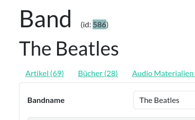

ID
==

Die ID-Nummer eines [Datensatzes](datensatz.md) findest du neben dem Namen der Kategorie:

  
<figure markdown="span">  
  { width="300" .mb-1 }  
  <figcaption>ID der Beatles</figcaption>  
</figure> 

[comment]: <> (@formatter:off)  
!!! info "Hinweis: Die Datenbank vergibt die IDs"  
    Jeder Datensatz einer Tabelle besitzt genau eine ID. Und eine ID identifiziert auch genau einen Datensatz einer Tabelle.
		Dadurch spielt die ID für die Datenbank eine enorm wichtige Rolle und kann deshalb von Benutzern nicht verändert
		werden - sie wird stattdessen von der Datenbank selbst vergeben.
  
[comment]: <> (@formatter:on)

Abgesehen von der Suche nach IDs im
[Suchformular](suchformular.md#id "Suchformular"), wird die ID eines Datensatzes zur Kennzeichnung von Foto-Materialien
verwendet:
[Foto#ID](foto.md#id "Foto")

