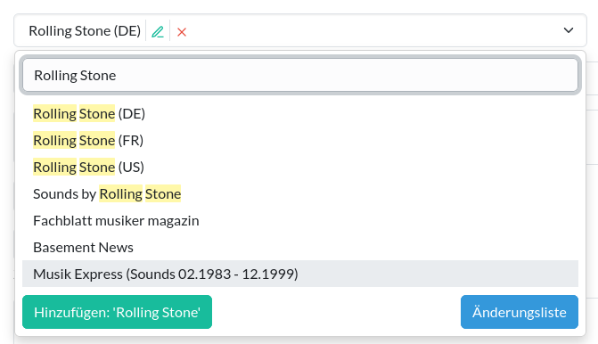

Über Verknüpfungen
==========

## Erklärung

In der Datenbank können Datensätze miteinander in **Beziehung** stehen. So hat zum Beispiel ein Artikel immer eine
Beziehung zu der Ausgabe, die den Artikel enthält. Anhand der Beziehung kommt man vom Artikel zu der Ausgabe, und von
der Ausgabe gelangt man so an alle Artikel dieser Ausgabe. Der Artikel und die Ausgabe sind miteinander **verknüpft**
oder **verwandt**. Andere Beziehungen wären zum Beispiel ein Buch und die Autoren, oder ein Musikalbum und die Künstler.

Auf der [Änderungsseite](oberflaeche.md#anderungsseite) eines Datensatzes findest du Links, die dich zu den verwandten
Datensätzen führt:

  
<figure markdown="span">  
  { width="600" .mb-1 }  
  <figcaption>Links zu verwandten Datensätzen</figcaption>  
</figure>

## Verknüpfungen im Formular

### Verknüpfung hinzufügen

In den Formularen werden diese Beziehungen dadurch realisiert, dass du den anderen Datensatz, den du verknüpfen
möchtest, in einem [Auswahlfeld](bedienelement.md#kombinationsfeldcombobox) auswählst. Je nach Art der Beziehung
geschieht dies direkt über ein Feld im Formular oder über ein Feld in einem [Inline](bedienelement.md#inlines).
Je eine Zeile in einem Inline repräsentiert je eine Verknüpfung zu einem anderen Datensatz.

  
<figure markdown="span">  
  { width="300" .mb-1 }  
  <figcaption>Auswahlfeld</figcaption>  
</figure>  
<figure markdown="span">  
  { width="300" .mb-1 }  
  <figcaption>Inline</figcaption>  
</figure>

### Verknüpfung änden

Um eine existierende Verknüpfung zu ändern, wähle im Auswahlfeld aus der Liste einen *anderen* Datensatz aus.

Achtung: Was du <u>nicht</u> machen darfst, ist einfach den Namen des verknüpften Datensatzes ändern!

Möchtest du zum Beispiel in einem Artikel den Verweis auf die Band "The Beatles" auf einen Verweis auf die Band
"A Completely Different Band" ändern, so darfst du nicht über die Änderungsseite der Beatles den Bandnamen einfach zu
"A Completely Different Band" umändern.

  
<figure markdown="span">  
  { width="300" .mb-1 }  
  <figcaption>Artikel vor der Änderung</figcaption>  
</figure>  
<figure markdown="span">  
  { width="300" .mb-1 }  
  <figcaption>Bandname wird geändert</figcaption>  
</figure>  
<figure markdown="span">  
  { width="300" .mb-1 }  
  <figcaption>Artikel nach der Änderung</figcaption>  
</figure>  

 

Zwar wird im Formular des Artikels dann eine Band mit dem erwarteten Namen
angezeigt, aber **dies gilt auch für jeden anderen Datensatz, der mit dem (ehemaligen) Beatles-Datensatz verknüpft ist:
auch dort hat sich der Name geändert!**

  
<figure markdown="span">  
  { width="300" .mb-1 }  
  <figcaption>Andere Artikel der ehemaligen Beatles verweisen jetzt auf die neue Band?</figcaption>  
</figure> 

Dies hat offensichtlich weitreichende Folgen, und aus diesem Grund warnt dich die Datenbank, wenn du den Namen eines
Datensatzes stark veränderst. Um Fehler zu vermeiden, musst du solche Änderungen explizit bestätigten:

  
<figure markdown="span">  
  { width="300" .mb-1 }  
  <figcaption>Bestätigung einer Änderung</figcaption>  
</figure> 

### Verknüpfung entfernen

Um eine Verknüpfung zu entfernen:

* **Auswahlfeld**: drücke auf den Button mit dem roten **X** neben dem ausgewählten Eintrag.
* **Inline**: markiere die Zeile durch einen Klick auf das rote **X** zur Löschung

Speicherst du danach den Datensatz ab, so wird die Verknüpfung - und nur die Verknüpfung - entfernt; der Datensatz, auf
den die Verknüpfung verwies, wird nicht gelöscht.

### Datensatz mit Verknüpfungen löschen

Wenn du einen Datensatz mit aktiven Beziehungen löscht, werden die Beziehungen ebenfalls gelöscht:

  
<figure markdown="span">  
  { width="300" .mb-1 }  
  <figcaption>In der Zusammenfassung einer Löschung werden die Beziehungen gelistet</figcaption>  
</figure>  

